#   Supply Chain Performance and Delivery Risk Analysis Using Business Intelligence                      
   

Authors: Raneem Jamal
Student ID: 202210362

Supervised by: Dr. Husam Barham
Course: 307498 - Graduation Project
Second Semester, 2026/2027

---

# Table of Contents

<h2><a href="#abstract">Abstract</a></h2>

<h2><a href="#acknowledgment">Acknowledgment</a></h2>

<h2><a href="#business-intelligence-project-description-and-objectives">Business Intelligence Project Description and Objectives</a></h2>

<h2><a href="#data-research-and-acquiring-effort">Data Research and Acquiring Effort</a></h2>

<h2><a href="#data-description-and-understanding">Data Description and Understanding</a></h2>

<h2><a href="#exploratory-data-analysis-eda">Exploratory Data Analysis (EDA)</a></h2>

<h2><a href="#data-primary-cleaning-and-transformation">Data Primary Cleaning and Transformation</a></h2>

<h2><a href="#data-visualization-and-insights">Data Visualization and Insights</a></h2>

<h3 style="margin-left:20px;"><a href="#dashboard-design--business-insights">Dashboard Design & Business Insights</a></h3>

<h2><a href="#advanced-analytics-and-ai-modeling">Advanced Analytics and AI Modeling</a></h2>

<h3 style="margin-left:20px;"><a href="#prediction-model">Prediction Model</a></h3>

<h4 style="margin-left:40px;"><a href="#logistic-regression">Logistic Regression</a></h4>

<h4 style="margin-left:40px;"><a href="#random-forest">Random Forest</a></h4>

<h3 style="margin-left:20px;"><a href="#clustering">Clustering</a></h3>

<h4 style="margin-left:40px;"><a href="#cluster-analysis-and-business-strategy">Cluster Analysis and Business Strategy</a></h4>

<h2><a href="#tools-research-and-selection-effort">Tools Research and Selection Effort</a></h2>

<h2><a href="#project-deployment-effort--use-case">Project Deployment Effort – Use Case</a></h2>

<h2><a href="#results">Results</a></h2>

<h2><a href="#references">References</a></h2>

---

# Abstract

This project investigates the application of Business Intelligence, data analytics, and machine learning techniques to analyze supply chain operations and improve operational efficiency, profitability, and delivery performance. Using the Supply Chain dataset, the study aims to support data-driven decision-making by identifying the key factors affecting delivery delays, operational risks, and overall supply chain performance. The project focuses on analyzing sales transactions, shipping operations, customer segments, regional performance, and product categories to uncover meaningful operational patterns and support supply chain optimization.

The implementation phase involved data cleaning, preprocessing, transformation, and exploration data analysis using KNIME. Interactive dashboards were developed in Power BI to visualize sales performance, profitability, shipping efficiency, regional operations, delivery delays, and late delivery risks. Predictive analytics was conducted using Logistic Regression and Random Forest classification models to predict late delivery risk within the supply chain process. In addition, K-Means clustering was applied to segment regions based on operational and financial performance indicators.

The results demonstrated that both predictive models achieved strong classification performance, with the Random Forest model outperforming Logistic Regression by capturing more complex relationships between variables. Analysis revealed that shipping mode, delivery duration, regional operations, order quantity, and product categories were among the most influential factors affecting late delivery risk and operational efficiency. Furthermore, clustering analysis identified meaningful regional segments such as high-performing regions, operational risk regions, and low-efficiency regions. Overall, the integration of business intelligence dashboards, predictive analytics, and clustering techniques provided actionable insights that support supply chain optimization, operational risk reduction, improved delivery performance, and strategic decision-making.

---

# Acknowledgment

First and foremost, I would like to thank Allah for giving me the strength, patience, and determination to successfully complete this project. His guidance and blessings helped me overcome challenges and continue this journey with confidence and perseverance.

I would also like to express my sincere gratitude to my professor and academic supervisor for their valuable guidance, continuous support, and constructive feedback throughout the development of this project. Their expertise, encouragement, and dedication played a major role in improving the quality of this work and expanding my knowledge in the field of Business Intelligence and Data Analytics.

A very special thanks goes to my family for their endless love, patience, and unwavering support throughout this journey. Their constant encouragement, belief in me, and support during difficult times gave me the motivation and confidence to continue striving toward my goals. I am deeply grateful for every sacrifice they made and for always standing beside me.

I would also like to thank my friends for their encouragement, support, and positive energy throughout this experience. Their motivation, advice, and emotional support made this journey easier and more enjoyable, and I truly appreciate having them by my side throughout this process.

Special appreciation is also extended to the faculty and staff members whose dedication and support created a positive learning environment that encouraged growth, learning, and creativity.

Finally, I would like to thank everyone who contributed directly or indirectly to the completion of this project. Your support and encouragement are sincerely appreciated and will always be remembered.

---

# Business Intelligence Project Description and Objectives

Project Description and Goal

This project focuses on applying Business Intelligence, data analytics, and machine learning techniques to analyze supply chain operations and improve delivery performance, operational efficiency, and profitability. Using the Supply Chain dataset, the project transforms raw operational data into meaningful insights through descriptive analytics, predictive modeling, and clustering techniques.

The project analyzes sales transactions, shipping operations, regional performance, product categories, customer segments, and delivery risk indicators to better understand the factors affecting supply chain efficiency and late delivery risk. KNIME was used for data preprocessing, predictive modeling, and clustering, while Power BI was used to develop interactive dashboards and visual analytics for decision support.

Project Objectives

Analyze Supply Chain Performance: Examine supply chain data to identify trends, operational patterns, and factors affecting delivery performance, profitability, and operational efficiency using descriptive analytics and visualization techniques.

Predict Late Delivery Risk: Develop and evaluate machine learning models, including Logistic Regression and Random Forest, to predict late delivery risk based on operational and shipping-related features.

Identify Key Factors Affecting Operational Efficiency: Determine the most influential variables affecting delivery performance and operational risk, such as shipping mode, delivery duration, regional operations, order quantity, product category, sales, and profit levels.

Segment Regions Using Clustering: Apply K-Means clustering to group regions based on operational and financial performance indicators to identify high-performing and high-risk operational regions.

Enhance Decision-Making Through Business Intelligence: Design interactive Power BI dashboards that visualize KPIs, operational trends, delivery risks, profitability analysis, and shipping performance to support data-driven decision-making in supply chain management.

---

# Data Research and Acquiring Effort

The data used in this project was obtained from a publicly available Supply Chain dataset containing real-world operational and transactional supply chain information. The primary objective during the data acquisition phase was to obtain a dataset that accurately represents supply chain activities, including sales transactions, shipping operations, delivery performance, customer segments, regional operations, and product categories. These factors are essential for analyzing operational efficiency, identifying delivery risks, and improving supply chain decision-making.

The selected dataset contains detailed information related to orders, products, customers, shipping modes, delivery status, regional performance, sales, profit, and late delivery risk indicators. The dataset was chosen because it provides comprehensive information required for descriptive analytics, predictive modeling, clustering, and business intelligence dashboard development within the supply chain domain.

The dataset was imported into KNIME, Microsoft Excel, and Power BI for data cleaning, preprocessing, transformation, visualization, and machine learning implementation. Since the dataset contains large-scale operational and logistical information, it provides a strong foundation for applying business intelligence, predictive analytics, and clustering techniques to supply chain management problems.

The selection of this data set enabled a comprehensive analysis of operational performance and delivery efficiency by combining descriptive analytics, predictive modeling, and clustering techniques. This supports the development of data-driven strategies that can help organizations improve logistics operations, reduce delivery delays, optimize resource allocation, enhance operational efficiency, and support strategic decision-making within supply chain management.

---

# Data Description and Understanding

Data Dictionary

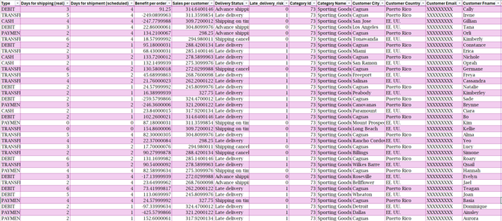

The dataset contains 180,519 rows and 53 columns.

| Column Name                   | Description                    | Use                                        |
| ----------------------------- | ------------------------------ | ------------------------------------------ |
| Type                          | Type of transaction            | Used to analyze transaction categories     |
| Days for shipping (real)      | Actual shipping duration       | Measures real delivery performance         |
| Days for shipment (scheduled) | Planned shipping duration      | Used to compare planned vs actual delivery |
| Benefit per order             | Profit generated per order     | Measures profitability                     |
| Sales per customer            | Revenue generated per customer | Customer sales analysis                    |
| Delivery Status               | Status of delivery             | Analyzes delivery outcomes                 |
| Late_delivery_risk            | Indicates late delivery risk   | Target variable for prediction             |
| Category Id                   | Product category ID            | Product categorization                     |
| Category Name                 | Product category name          | Category performance analysis              |
| Customer City                 | Customer city                  | Geographic analysis                        |
| Customer Country              | Customer country               | Regional performance analysis              |
| Customer Email                | Customer email                 | Identification only                        |
| Customer Fname                | Customer first name            | Identification only                        |
| Customer Id                   | Unique customer identifier     | Customer-level analysis                    |
| Customer Lname                | Customer last name             | Identification only                        |
| Customer Password             | Customer password field        | Not used in analysis                       |
| Customer Segment              | Customer segment type          | Customer segmentation                      |
| Customer State                | Customer state                 | Regional analysis                          |
| Customer Street               | Customer address               | Identification only                        |
| Customer Zipcode              | Customer postal code           | Geographic analysis                        |
| Department Id                 | Department identifier          | Department categorization                  |
| Department Name               | Department name                | Department performance analysis            |
| Latitude                      | Geographic latitude            | Map visualizations                         |
| Longitude                     | Geographic longitude           | Map visualizations                         |
| Market                        | Market region                  | Market analysis                            |
| Order City                    | Order city                     | Delivery and regional analysis             |
| Order Country                 | Order country                  | Geographic analysis                        |
| Order Customer Id             | Customer order identifier      | Order tracking                             |
| Order Date                    | Date of order                  | Trend and time analysis                    |
| Order Id                      | Unique order identifier        | Order-level analysis                       |
| Order Item Cardprod Id        | Product card identifier        | Product tracking                           |
| Order Item Discount           | Discount amount                | Discount analysis                          |
| Order Item Discount Rate      | Discount percentage            | Pricing analysis                           |
| Order Item Id                 | Order item identifier          | Transaction analysis                       |
| Order Item Product Price      | Product price                  | Pricing analysis                           |
| Order Item Profit Ratio       | Profit ratio per item          | Profitability analysis                     |
| Order Item Quantity           | Quantity ordered               | Demand analysis                            |
| Sales                         | Total sales amount             | Revenue analysis                           |
| Order Item Total              | Total order item value         | Financial analysis                         |
| Order Profit Per Order        | Profit per order               | Profitability analysis                     |
| Order Region                  | Region of the order            | Regional operational analysis              |
| Order State                   | State of order                 | Geographic analysis                        |
| Order Status                  | Status of order                | Order process monitoring                   |
| Product Card Id               | Product card identifier        | Product tracking                           |
| Product Category Id           | Product category ID            | Product categorization                     |
| Product Description           | Product details                | Product information                        |
| Product Image                 | Product image link             | Product visualization                      |
| Product Name                  | Product name                   | Product performance analysis               |
| Product Price                 | Product price                  | Revenue and pricing analysis               |
| Product Status                | Product availability status    | Inventory/product monitoring               |
| Shipping date (DateOrders)    | Shipping date                  | Delivery trend analysis                    |
| Shipping Mode                 | Shipping method                | Shipping performance analysis              |
| Order Zipcode                 | Order postal code              | Geographic analysis                        |

---

# Exploratory Data Analysis (EDA)

Initial Exploratory Data Analysis (EDA) was performed to understand the structure, distribution, and operational behavior of the supply chain data before applying predictive and clustering models. Various visualizations, statistical summaries, and comparative analyses were used to identify patterns, trends, and operational inefficiencies related to project objectives.

Histograms and descriptive statistics were applied to numerical variables such as Sales, Order Profit Per Order, Delivery Delay, Product Price, and Order Quantity. The analysis showed that sales and profit distributions were right-skewed, indicating that a small number of transactions contribute significantly higher revenue and profit. Box plots also revealed the presence of outliers in sales, profit, and delivery duration, reflecting unusual operational cases and large transactions.

Bar charts, pie charts, and pivot tables were used to analyze categorical variables such as Shipping Mode, Order Region, Customer Segment, Delivery Status, and Product Category. The analysis showed that certain regions contributed more significantly to overall sales and profitability, while some shipping methods experienced higher delivery delays and operational risks.

Scatter plots and comparative visualizations were used to examine relationships between variables such as Sales and Profit, Delivery Delay and Late Delivery Risk, and Actual versus Scheduled Shipping Duration. The results indicated that increased delivery delays were associated with higher late delivery risk and operational inefficiencies.

Overall, the EDA phase provided valuable insights into supply chain performance, operational risks, regional differences, and profitability patterns. These findings supported feature selection for predictive modeling and clustering while contributing to improved supply chain optimization and data-driven decision-making through Business Intelligence.

---

# Data Primary Cleaning and Transformation

Data cleaning and transformation prepared the supply chain dataset for reliable analysis by correcting inconsistencies, removing unnecessary records, and improving overall data quality.

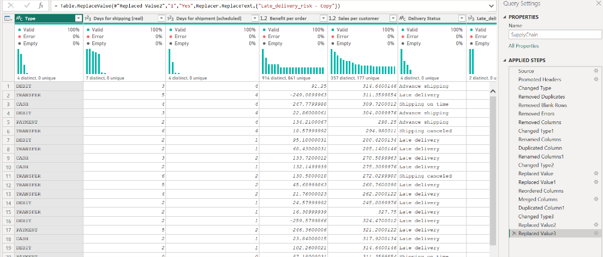

Data Cleaning and Transformation Steps

Changed Data Types: Columns were assigned appropriate data types such as numerical, categorical, text, and date formats to ensure accurate analysis and visualization.

Removed Duplicate Records: Duplicate rows were identified and removed to improve data consistency and avoid biased results.

Removed Blank Rows and Errors: Blank rows, missing values, and invalid records were filtered and removed to maintain a clean and reliable dataset.

Renamed and Reordered Columns: Columns were renamed and reorganized to improve readability and dashboard usability.

Replaced and Standardized Values: Fields such as _Late_delivery_risk_ were transformed from numerical values into meaningful labels (Yes/No) to improve interpretability.

Merged and Duplicated Columns: Additional columns were created to support KPI calculations, operational analysis, and dashboard reporting.

Filtered Irrelevant Data: Unnecessary and inconsistent records were removed to keep only meaningful operational data for analysis and predictive modeling.

Purpose: These preprocessing steps ensured that the dataset became accurate, consistent, and analysis-ready for exploratory analysis, business intelligence dashboards, predictive modeling, and clustering techniques.

---

# Data Visualization and Insights

## Dashboard Design & Business Insights

*Supply Chain Operations & Delivery Performance Overview*

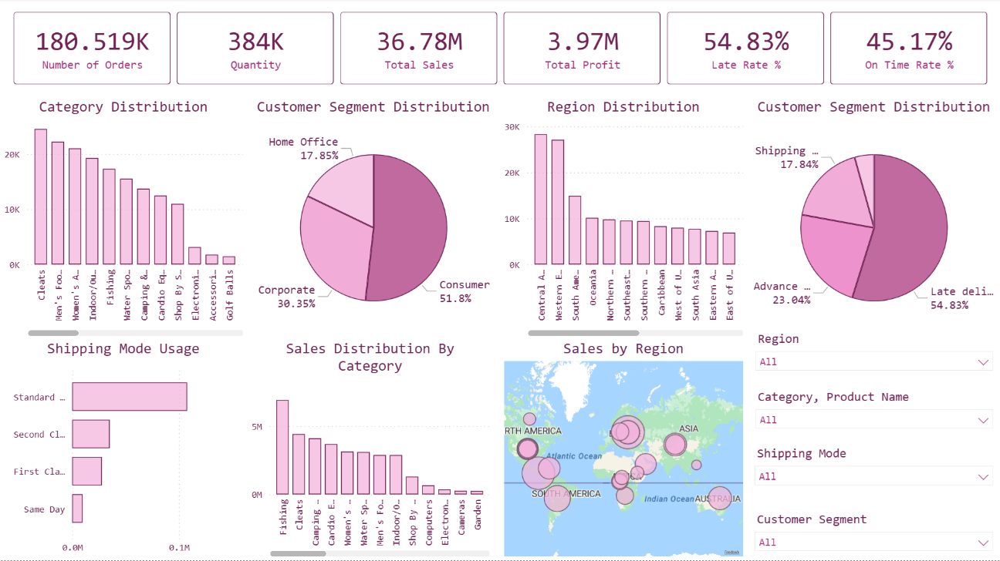

Dashboard Purpose

This dashboard provides an overview of supply chain operations, delivery performance, profitability, customer behavior, and operational risks. It helps monitor KPIs, identify inefficiencies, analyze regional and product performance, and support data-driven decision-making for supply chain optimization.

Business Use

- Monitor operational and financial performance
- Identify high-sales and high-risk regions or categories
- Analyze customer behavior and shipping efficiency
- Detect late delivery issues and operational bottlenecks
- Support logistics planning and operational improvement

How This Dashboard Supports the Study?

- Providing descriptive analytics and operational insights
- Identifying factors affecting late delivery risk
- Supporting predictive modeling and clustering analysis
- Enabling interactive business intelligence reporting
- Supporting data-driven supply chain optimization

1\. KPI Cards

Number of Orders, Quantity, Total Sales, Total Profit, Late Rate %, & On Time Rate %

Description: These KPI cards summarize the overall operational and financial performance of the supply chain.

Insights

- High sales and quantity indicate strong operational activity
- Late delivery rate is higher than on-time delivery rate
- Profitability can be compared against operational volume

Business Use

- Enables quick monitoring of business performance
- Help management track operational efficiency
- Supports strategic decision-making using real-time KPIs

Support for Study: These KPIs provide the foundation for analyzing operational efficiency, profitability, and delivery performance.

2\. Category Distribution (Bar Chart)

Description: Shows the distribution of orders across product categories.

Insights

- Some product categories generate significantly higher operational activity
- Certain categories dominate overall order volume

Business Use

- Helps identify high-demand product categories
- Supports inventory planning and resource allocation

Support for Study: Supports product-level operational analysis and identifies categories contributing to supply chain pressure.

3\. Customer Segment Distribution (Pie Chart)

Description: Displays the percentage distribution of customer segments.

Insights

- Consumer segment represents the largest customer group
- Corporate and Home Office segments contribute differently to operations

Business Use

- Helps understand customer purchasing behavior
- Supports targeted operational and marketing strategies

Support for Study: Supports customer segmentation analysis and clustering preparation.

4\. Region Distribution (Bar Chart)

Description: Shows operational distribution across regions.

Insights

- Certain regions generate higher operational activity
- Regional imbalance may indicate logistical concentration

Business Use

- Supports regional performance evaluation
- Helps optimize regional logistics operations

Support for Study: Helps identify high-performing and high-risk operational regions.

5\. Delivery Status Distribution (Pie Chart)

Description: Displays the proportion of delivery outcomes such as late delivery, advance shipping, and shipping on time.

Insights

- Late deliveries represent the largest operational issue
- On-time delivery performance requires improvement

Business Use

- Monitors delivery performance efficiency
- Helps identify operational bottlenecks

Support for Study: Directly supports the project's focus on late delivery risk prediction.

6\. Shipping Mode Usage (Horizontal Bar Chart)

Description: Shows the usage frequency of different shipping modes.

Insights

- Standard Class is the most frequently used shipping method
- Faster shipping modes are used less frequently

Business Use

- Evaluates shipping strategy effectiveness
- Supports logistics optimization

Support for Study: Help analyze relationships between shipping mode and delivery risk.

7\. Sales Distribution by Category (Bar Chart)

Description: Displays total sales generated by each product category.

Insights

- Some categories generate significantly higher revenue
- High operational activity does not always mean high profitability

Business Use

- Supports product profitability analysis
- Helps prioritize high-revenue categories

Support for Study: Supports financial and operational performance analysis.

8\. Sales by Region (Map Visualization)

Description: Visualizes sales performance geographically across regions.

Insights

- Certain regions dominate global sales activity
- Geographic operational patterns become more visible

Business Use

- Supports regional strategy and logistics planning
- Helps identify high-sales and low-performance areas

Support for Study: Supports clustering analysis and regional operational evaluation.

9\. Interactive Filters (Slicers)

Region, Category/Product Name, Shipping Mode, & Customer Segment

Description: Allows users to interactively filter and analyze supply chain performance.

Business Use

- Enables dynamic operational analysis
- Improves decision-making flexibility

Support for Study: Enhance business intelligence functionality and supports deeper operational exploration.

---

*Supply Chain Profitability & Shipping Performance*

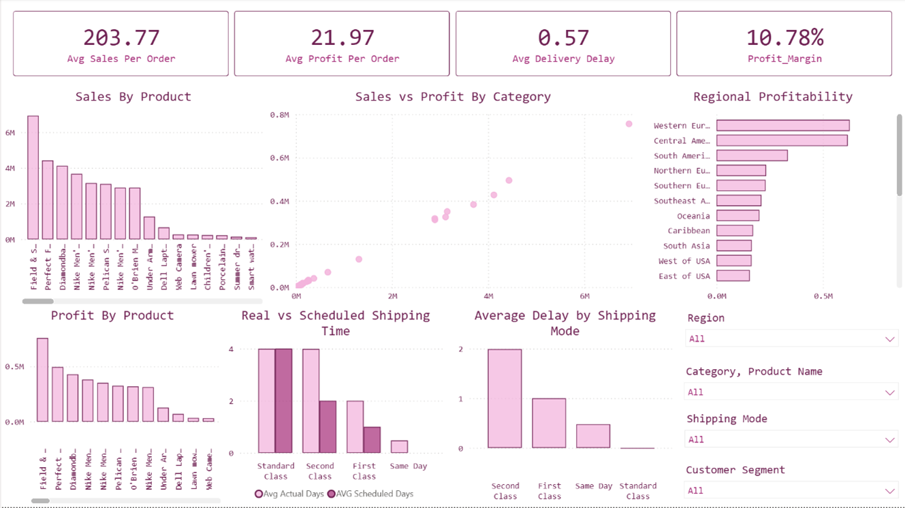

Dashboard Purpose

This dashboard analyzes profitability, product performance, shipping efficiency, and regional operational performance across the supply chain. It helps identify high-performing products, profitable regions, shipping delays, and operational inefficiencies to support better business decisions and supply chain optimization.

Business Use

- Monitor profitability and sales performance
- Identify top-performing products and regions
- Evaluate shipping efficiency and delivery delays
- Compare actual vs scheduled shipping performance
- Improve logistics planning and reduce delays
- Support operational and financial decision-making

How This Dashboard Supports the Study?

- Providing descriptive insights into sales, profit, and shipping performance
- Identifying factors affecting delays and profitability
- Supporting predictive models for delivery risk
- Helping discover patterns useful for clustering analysis
- Improving supply chain optimization through BI dashboards

1\. KPI Cards

Average Sales Per Order, Average Profit Per Order, Average Delivery Delay, & Profit Margin %

Description: These KPIs summarize overall financial and operational performance.

Insight

- Average profit is relatively low compared to average sales
- Delivery delays still affect operations
- Profit margin indicates overall efficiency

Business Use: Help managers monitor profitability and operational performance quickly.

Support for Study: Provides baseline indicators for evaluating supply chain efficiency.

2\. Sales by Product (Bar Chart)

Description: Displays total sales generated by products.

Insight: Some products generate significantly higher sales than others.

Business Use: Help identify high-demand products for inventory planning.

Support for Study: Supports product-level performance analysis and demand patterns.

**3\. Profit by Product (Bar Chart)**

Description: Shows profit contribution by products.

Insight: High sales products may not always produce high profits.

Business Use: Supports product profitability evaluation and pricing decisions.

Support for Study: Help identify profitable product segments.

4\. Sales vs Profit by Category (Scatter Plot)

Description: Compares sales and profit relationship across categories.

Insight: Strong positive relationship exists between sales and profit, but profitability differs among categories.

Business Use: Help determine categories with efficient profit generation.

Support for Study: Useful for identifying operational efficiency patterns.

5\. Regional Profitability (Horizontal Bar Chart)

Description: Displays profit distribution across regions.

Insight: Some regions generate higher profits despite similar sales levels.

Business Use: Supports regional strategy and resource allocation.

Support for Study: Helps identify high-performing and low-performing regions.

6\. Real vs Scheduled Shipping Time (Clustered Column Chart)

Description: Compare actual shipping time with scheduled shipping time by shipping mode.

Insight: Actual delivery often exceeds scheduled delivery, indicating delays.

Business Use: Help evaluate shipping performance and logistics efficiency.

Support for Study: Directly supports analysis of delivery delay and late risk prediction.

7\. Average Delay by Shipping Mode (Bar Chart)

Description: Shows average delivery delay for each shipping method.

Insight: Certain shipping modes experience greater delays.

Business Use: Help optimize shipping strategy and improve delivery performance.

Support for Study: Identifies shipping modes contributing to late delivery risk.

8\. Interactive Filters (Slicers)

Region, Category/Product Namem Shipping Mode, & Customer Segment

Description: Allows users to analyze performance dynamically across different operational factors.

Business Use: Improves flexibility in decision-making and operational monitoring.

Support for Study: Enhances BI capabilities and enables deeper exploration of supply chain patterns.

---

*Late Delivery Risk & Logistics Performance*

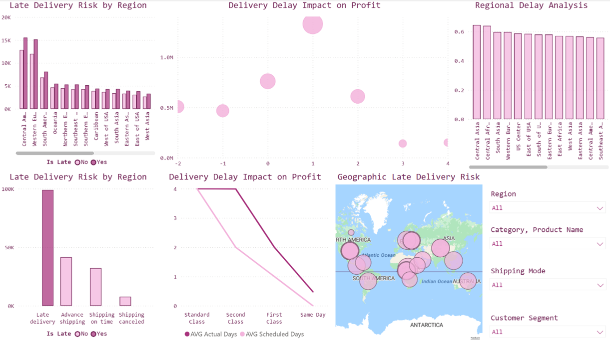

Dashboard Purpose

This dashboard focuses on analyzing delivery delays, late delivery risks, shipping performance, and regional logistics efficiency. It helps identify regions with high late delivery risk, evaluate the impact of delays on profitability, and improve shipping operations to enhance overall supply chain performance.

Business Use

- Monitor late delivery rates and shipping performance
- Identify high-risk regions with frequent delays
- Analyze how delivery delays affect profitability
- Evaluate shipping mode efficiency
- Improve logistics planning and reduce operational risks
- Support supply chain optimization and decision-making

How This Dashboard Supports the Study?

- Identifying factors contributing to late delivery risk
- Providing insights into predictive modeling of delays
- Supporting clustering analysis through regional and operational patterns
- Enhancing supply chain optimization through business intelligence

1\. Late Delivery Risk by Region (Clustered Bar Chart)

Description: Shows the number of late and non-late deliveries across different regions.

Insight: Some regions experience significantly higher late delivery rates than others, indicating operational inefficiencies.

Business Use: Helps identify regions requiring logistics improvement.

Support for Study: Directly supports analysis of late delivery risk factors.

2\. Delivery Delay Impact on Profit (Bubble Chart)

Description: Displays the relationship between delivery delay duration and profit.

Insight: Longer delivery delays tend to reduce profitability, showing the financial impact of inefficient logistics.

Business Use: Help evaluate the cost of delays on business performance.

Support for Study: Supports identifying variables affecting operational profitability.

**3\. Regional Delay Analysis (Bar Chart)**

Description: Shows average delivery delay across regions.

Insight: Certain regions consistently experience longer delays than others.

Business Use: Supports regional logistics optimization and resource allocation.

Support for Study: Help identify geographic patterns contributing to late delivery risk.

4\. Delivery Status Distribution (Bar Chart)

Description: Displays delivery outcomes such as late delivery, advance shipping, on-time shipping, and canceled shipments.

Insight: Late deliveries represent the largest proportion of shipping outcomes.

Business Use: Help monitor overall delivery performance and operational efficiency.

Support for Study: Supports prediction of delivery risk and operational analysis.

5\. Delivery Delay Impact by Shipping Mode (Line Chart)

Description: Compares actual shipping time with scheduled shipping time across shipping methods.

Insight: Standard and Second-Class shipping show greater delays compared to faster shipping modes.

Business Use: Help evaluate shipping efficiency and optimize transportation strategies.

Support for Study: Useful for predicting delivery delays based on shipping mode.

6\. Geographic Late Delivery Risk (Map Visualization)

Description: Displays geographic distribution of late delivery risk across regions.

Insight: Some areas experience higher delivery risk concentrations.

Business Use: Supports logistics planning and regional operational improvement.

Support for Study: Helps identify spatial patterns for clustering and risk analysis.

7\. Interactive Filters (Slicers)

Region, Category/Product Name, Shipping Mode, & Customer Segment

Description: Allows dynamic exploration of delivery performance and operational risks.

Business Use: Improves flexibility in monitoring and decision-making.

Support for Study: Enhances BI capabilities and deeper operational analysis.

---

*Supply Chain Risk, Customer Segmentation & Regional Performance*

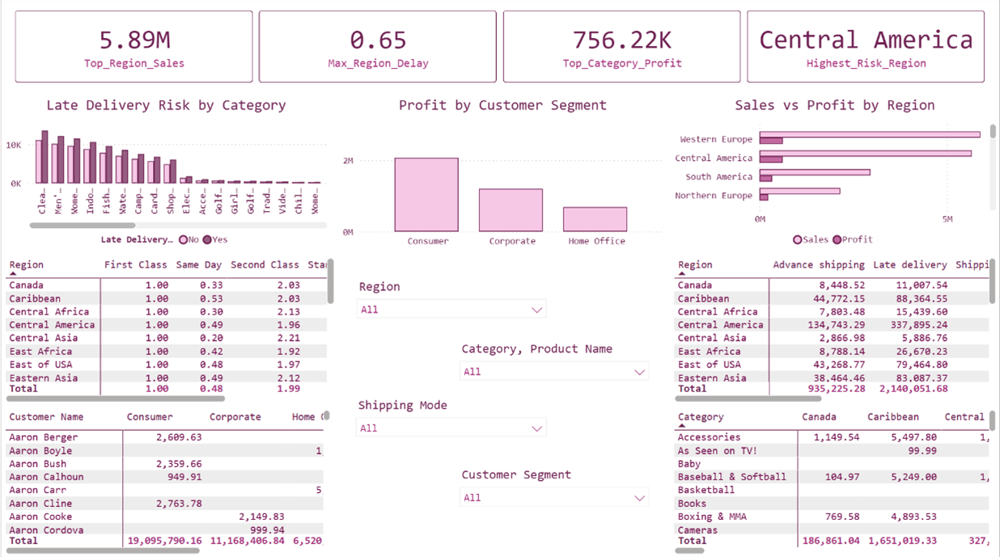

Dashboard Purpose

This dashboard analyzes late delivery risk, customer profitability, regional performance, and category-level operational risk. It helps identify high-risk regions, profitable customer segments, and relationships between sales, profit, and delivery performance to support strategic decision-making.

Business Use

- Identify regions with the highest delivery risk
- Monitor profitability across customer segments
- Analyze sales and profit performance by region
- Detect product categories with high late delivery risk
- Support logistics optimization and customer-focused strategies
- Improve operational efficiency and profitability

How This Dashboard Supports the Study?

- Identifying factors affecting late delivery risk
- Supporting customer segmentation and clustering analysis
- Providing features useful for predictive modeling
- Enhancing supply chain optimization through BI insights

1\. KPI Cards

Top Region Sales, Maximum Region Delay, Top Category Profit, & Highest Risk Region

Description: These KPIs summarize top-performing regions, profitability, and operational risk.

Insight

- Central America has the highest delivery risk
- Some categories generate significantly higher profits
- Delays vary across regions

Business Use: Helps management quickly monitor critical operational indicators.

Support for Study: Provides key variables for risk analysis and predictive modeling.

2\. Late Delivery Risk by Category (Clustered Bar Chart)

Description: Shows late and non-late delivery counts across product categories.

Insight: Certain categories have higher late delivery rates.

Business Use: Supports inventory and logistics planning for high-risk categories.

Support for Study: Identifies category-level factors contributing to delivery delays.

3\. Profit by Customer Segment (Bar Chart)

Description: Displays profit generated by customer segments.

Insight: Consumer segment generates the highest profitability.

Business Use: Help prioritize valuable customer groups.

Support for Study: Supports customer segmentation and clustering analysis.

4\. Sales vs Profit by Region (Bar Chart)

Description: Compares regional sales with profit generation.

Insight: High sales do not always produce proportional profit.

Business Use: Supports regional performance evaluation and strategic planning.

Support for Study: Help identify efficient and inefficient operational regions.

5\. Shipping Performance by Region (Matrix Table)

Description: Shows average shipping performance by shipping mode and region.

Insight: Shipping delays vary depending on both region and shipping mode.

Business Use: Supports logistics optimization.

Support for Study: Useful for identifying predictors of late delivery risk.

6\. Customer Segment Profit Matrix (Table)

Description: Displays customer profitability across different segments.

Insight: Some customer groups contribute significantly more profit.

Business Use: Supports customer-focused strategies and segmentation.

Support for Study: Provides patterns useful for clustering models.

7\. Regional Delivery Status Matrix (Table)

Description: Shows counts of advance shipping, late delivery, and shipping outcomes by region.

Insight: Certain regions experience substantially higher late delivery rates.

Business Use: Helps monitor regional operational performance.

Support for Study: Supports delivery risk prediction and regional analysis.

8\. Category Profit by Region Matrix (Table)

Description: Displays category profitability across regions.

Insight: Profitability differs significantly by both category and location.

Business Use: Supports product strategy and regional planning.

Support for Study: Help identify profitable operational combinations.

9\. Interactive Filters (Slicers)

Region, Category/Product Name, Shipping Mode, & Customer Segment

Description: Allows dynamic analysis of operational performance and risks.

Business Use: Improves flexibility in monitoring and decision-making.

Support for Study: Enhances BI capabilities and deeper analytical exploration.

---

# Advanced Analytics and AI Modeling

This phase of the project focused on applying machine learning and advanced analytics techniques to analyze supply chain performance, delivery efficiency, profitability, and operational risk. KNIME was used to build predictive models and perform clustering analysis to identify patterns related to late delivery risk and operational performance.

Supervised Models

To support predictive analysis and improve supply chain decision-making, supervised machine learning models were implemented to predict **late delivery risk** based on operational, shipping, and customer-related variables.

• Logistic Regression

Logistic Regression was used as a baseline classification model due to its simplicity and interpretability. The model analyzed how variables such as shipping mode, region, category, delivery status, customer segment, and order characteristics influence the probability of late deliveries.

• Random Forest

Random Forest was selected because of its ability to capture complex relationships between supply chain variables and delivery outcomes. By combining multiple decision trees, the model improves prediction accuracy and reduces overfitting, making it effective for analyzing late delivery risk and operational performance.

Clustering Analysis

K-Means clustering was applied to segment operational patterns, customer behavior, and regional performance into distinct groups based on factors such as sales, profit, delivery delay, shipping performance, and customer segment characteristics.

The clustering process helped identify:

- High-risk regions with frequent delivery delays
- High-performing customer segments
- Profitable product categories and operational patterns
- Regions with strong sales but low profitability
- Supply chain patterns associated with late deliveries and operational inefficiencies

---

## Prediction Model

Predictive analytics was applied in this project to identify and predict late deliveries within the supply chain using historical order, product, customer, and shipping data. Machine learning models were implemented in KNIME to support proactive decision-making, improve delivery performance, and reduce operational risks.

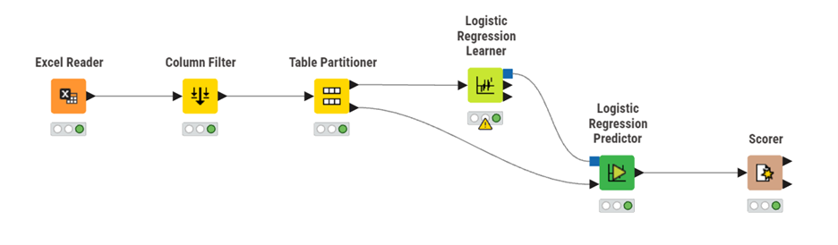
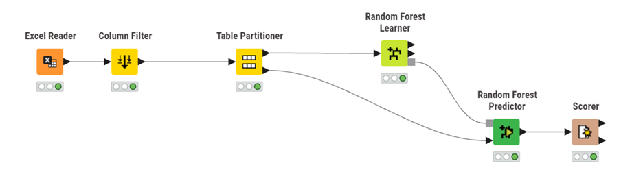

Excel Reader: Imported the supply chain dataset into KNIME for analysis.

Column Filter: Selected the most relevant variables influencing delivery performance, including shipping days, product category, customer segment, market, sales, quantity, region, product price, shipping mode, and product status.

Table Partitioner: Split the dataset into training and testing sets to evaluate model performance on unseen data.

Logistic Regression Learner and Predictor:  Developed a classification model to predict whether an order would be delivered late (**Is Late**) based on operational and customer-related attributes.

Random Forest Learner and Predictor: Applied an ensemble classification model capable of capturing more complex relationships among variables and improving prediction accuracy.

Scorer: Evaluated model performance using classification metrics such as Accuracy, Precision, Recall, F1-Score, and Confusion Matrix.

---

### Logistic Regression

The Logistic Regression model was implemented in KNIME to predict late deliveries within the supply chain using historical operational, shipping, product, and customer data. The model aimed to classify whether an order would be delivered late (**Yes**) or on time (**No**) based on selected supply chain features.

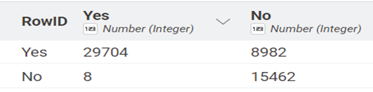

The confusion matrix results showed:

- 29,704 late deliveries were correctly predicted as late.
- 15,462 on-time deliveries were correctly predicted as on time.
- 8,982 on-time deliveries were incorrectly predicted as late.
- 8 late deliveries were incorrectly predicted as on time.

The model achieved an overall **accuracy of 83.4%,** indicating strong predictive performance in identifying delivery outcomes.

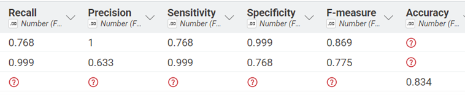

The evaluation metrics demonstrated good classification performance:

- Recall (Sensitivity): 76.8% for on-time deliveries and 99.9% for late deliveries
- Precision: 100% for on-time deliveries and 63.3% for late deliveries
- Specificity: 99.9% and 76.8%
- F-Measure: 86.9% and 77.5%

These results indicate that the Logistic Regression model performed exceptionally well in detecting late deliveries while maintaining strong overall classification accuracy. The model supports supply chain risk prediction by helping organizations identify potential delivery delays, improve shipping efficiency, optimize logistics operations, and enhance data-driven operational decision-making.

---

### Random Forest

The Random Forest model was implemented in KNIME to improve the prediction of late deliveries within the supply chain. The model used operational, shipping, product, and customer-related variables to classify whether an order would be delivered late (**Yes**) or on time (**No**).

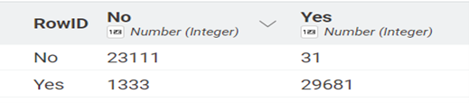

The confusion matrix results showed:

- **23,111** on-time deliveries were correctly predicted as on time.
- **29,681** late deliveries were correctly predicted as late.
- **31** on-time deliveries were incorrectly predicted as late.
- **1,333** late deliveries were incorrectly predicted as on time.

The model achieved an overall **accuracy of 97.5%,** demonstrating excellent predictive performance and high classification reliability.

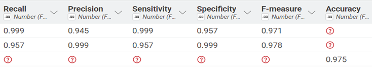

The evaluation metrics also showed strong model performance:

- Recall (Sensitivity): 99.9% for on-time deliveries and 95.7% for late deliveries
- Precision: 94.5% for on-time deliveries and 99.9% for late deliveries
- Specificity: 95.7% and 99.9%
- F-Measure: 97.1% and 97.8%

These results indicate that the Random Forest model significantly outperformed Logistic Regression by achieving higher accuracy and better classification balance. The model was highly effective in identifying both late and on-time deliveries, making it valuable for predicting operational risks, improving delivery planning, optimizing logistics performance, and supporting data-driven supply chain decision-making.

---

*Model Comparison*

Two supervised machine learning models, **Logistic Regression** and **Random Forest**, were implemented in KNIME to predict late deliveries within the supply chain. Both models were evaluated using classification metrics including Accuracy, Recall, Precision, Specificity, and F-Measure to determine their effectiveness in predicting delivery performance and operational risks.

| Metric      | Logistic Regression | Random Forest |
| ----------- | ------------------- | ------------- |
| Accuracy    | 83.4%               | 97.5%         |
| Recall      | 76.8% - 99.9%       | 95.7% - 99.9% |
| Precision   | 100% / 63.3%        | 94.5% / 99.9% |
| F-Measure   | 86.9% / 77.5%       | 97.1% / 97.8% |
| Specificity | 99.9% / 76.8%       | 95.7% / 99.9% |

Logistic Regression provided strong baseline performance with an overall accuracy of **83.4%**. The model performed exceptionally well in detecting late deliveries, achieving a recall value of **99.9%**, meaning that almost all delayed orders were correctly identified. However, the model showed lower balance in classification performance compared to Random Forest, particularly in handling more complex operational patterns within the supply chain data.

Random Forest achieved significantly better results across nearly all evaluation metrics. The model reached an overall accuracy of **97.5%**, indicating highly reliable classification performance. It also produced very high precision, recall, and F-measure values for both late and on-time deliveries, demonstrating excellent predictive capability and balanced classification performance.

The confusion matrix results further confirmed the superiority of the Random Forest model. It correctly classified **29,681** late deliveries and **23,111** on-time deliveries while producing very few misclassifications. In comparison, Logistic Regression generated a higher number of incorrectly classified orders, especially for on-time deliveries predicted as late.

**Winning Model**

The Random Forest model outperformed Logistic Regression and was selected as the best-performing predictive model in this project. Its ability to capture complex relationships between shipping conditions, customer behavior, operational variables, and delivery outcomes resulted in substantially higher predictive accuracy and stronger overall model reliability.

The model provides valuable support for supply chain optimization by enabling organizations to:

- Predict potential delivery delays more accurately
- Improve shipping and logistics planning
- Reduce operational risks
- Enhance delivery performance monitoring
- Support data-driven operational decision-making

Overall, Random Forest proved to be the most effective model for late delivery prediction and supply chain risk analysis within this study.

---

## Clustering

Clustering analysis was applied in this project using the K-Means algorithm in KNIME to segment supply chain operations into different groups based on delivery performance, shipping behavior, sales, and customer-related patterns. The purpose of clustering was to identify hidden operational patterns and support more effective supply chain decision-making.

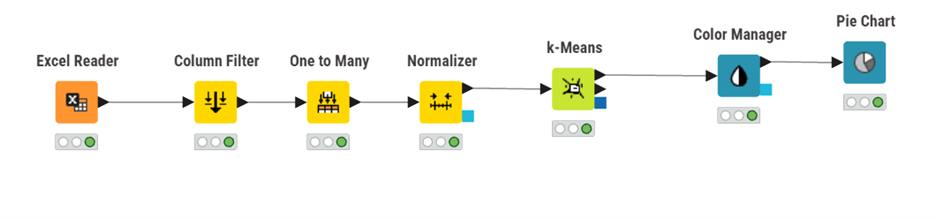

The following steps were implemented in KNIME:

Excel Reader: Imported the supply chain dataset into KNIME.

Column Filter: Selected important variables related to shipping days, sales, quantity, product category, customer segment, region, shipping mode, and delivery performance.

One to Many: Converted categorical variables into numerical format to prepare the data for clustering analysis.

Normalizer: Standardized numerical variables to improve clustering accuracy and consistency.

K-Means: Applied the K-Means clustering algorithm to divide the data into distinct operational groups based on similarities between records.

Color Manager: Assigned colors to clusters for easier visualization and interpretation.

Pie Chart: Visualized the distribution of clusters and the percentage of records within each segment.

The clustering analysis helped identify meaningful supply chain segments such as high-risk delivery groups, high-sales operational segments, efficient shipping patterns, and low-performance regions. These insights support organizations in improving logistics planning, optimizing delivery operations, reducing late delivery risks, enhancing customer segmentation, and supporting data-driven supply chain management through business intelligence and advanced analytics.

---

### Cluster Analysis and Business Strategy

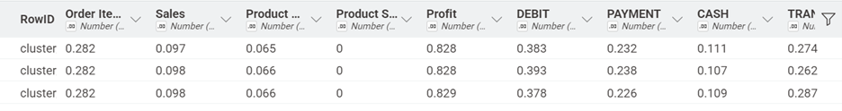
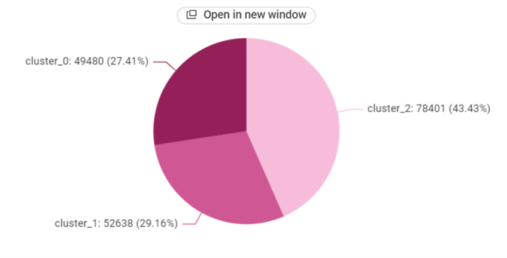

Cluster 0 - High-Risk Delayed Orders

Characteristics:

- Represents **27.41%** of the dataset
- Very high late delivery rate
- Higher use of **Second Class** and **First Class** shipping
- Strong sales and profit contribution
- Higher operational risk and delivery delays

Business Strategy:

- Improve shipping route planning and warehouse coordination
- Monitor high-risk regions and delayed product categories
- Apply predictive monitoring for delay prevention
- Optimize carrier and logistics performance

Study Support: This cluster helps identify operational bottlenecks and supports late delivery prediction and supply chain risk analysis.

Cluster 1 - Moderate Performance Customers

Characteristics:

- Represents **29.16%** of the dataset
- Moderate sales, profit, and delivery performance
- Balanced shipping methods and customer activity
- Moderate risk of delays and operational inefficiencies

Business Strategy:

- Improve customer experience and shipping efficiency
- Apply targeted promotions and inventory optimization
- Enhance order tracking and operational monitoring

Study Support: This cluster supports customer segmentation analysis and helps evaluate differences in operational behavior and profitability.

Cluster 2 - High-Performance On-Time Orders

Characteristics:

- Represents 43.43% of the dataset
- Very high on-time delivery performance
- Higher use of Standard Class shipping
- Stable sales and profit generation
- Lowest operational risk among clusters

Business Strategy:

- Maintain current logistics and fulfillment processes
- Focus on customer retention and service quality
- Use this cluster as a benchmark for operational best practices

Study Support: This cluster highlights efficient operational patterns and supports supply chain optimization and performance benchmarking.

---

# Tools Research and Selection Effort

Several tools were selected and used throughout this project to support data preprocessing, machine learning, clustering, and dashboard visualization for supply chain and sales analysis.

KNIME was used to build machine learning and clustering workflows. It was used for:

- Data preprocessing and normalization
- Feature selection and column filtering
- Converting categorical variables into numerical values using One-to-Many encoding
- Splitting data into training and testing sets
- Building Logistic Regression and Random Forest prediction models
- Applying K-Means clustering
- Evaluating model performance using classification metrics such as accuracy, precision, recall, and F-measure

KNIME provided a visual and efficient workflow environment that simplified the implementation and comparison of analytical models.

Power BI was used to create interactive dashboards and visual analytics for supply chain performance. The dashboards focused on:

- Sales and profit analysis
- Regional and market performance
- Shipping and delivery performance
- Late delivery risk analysis
- Product category analysis
- Customer and payment behavior
- Operational KPIs and trends

Power BI helped transform the analytical results into interactive business insights that support operational monitoring and strategic decision-making.

Together, KNIME and Power BI created a complete business intelligence workflow from data preparation and AI modeling to visualization and decision support.

---

# Project Deployment Effort - Use Case

1\. Dashboard Monitoring and Decision Support

The Power BI dashboards were developed to help monitor overall supply chain and sales performance through interactive visualizations and KPIs. The dashboards focused on:

- Sales and profit performance
- Regional and market analysis
- Shipping performance and delivery status
- Late delivery risk analysis
- Product category performance
- Customer and payment behavior

Business Uses

- Monitor operational and sales performance in real time
- Identify regions and products with high sales or operational risks
- Detect delivery delays and shipping inefficiencies
- Support inventory and logistics planning
- Improve strategic and data-driven decision-making

2\. Prediction Models - Sales and Delivery Risk Prediction

Machine learning models were implemented in KNIME to predict operational outcomes such as late delivery risk and order performance using historical supply chain data.

**Business Uses**

- Predict high-risk and delayed deliveries
- Identify operational patterns affecting performance
- Improve shipping and logistics planning
- Reduce operational inefficiencies and delivery risks
- Support proactive supply chain decision-making

The Random Forest model achieved the highest predictive performance, while Logistic Regression provided interpretable baseline results.

**3\. Clustering - Customer and Operational Segmentation**

K-Means clustering was applied to group customers, products, and operational behaviors into different segments based on sales, profit, shipping methods, product categories, and delivery performance.

Business Applications

- Identify high-value customer and product groups
- Detect high-risk operational segments
- Improve customer targeting and inventory planning
- Support personalized business strategies
- Enhance supply chain efficiency and profitability

Overall Business Value

By combining dashboards, predictive analytics, and clustering techniques:

- Dashboards answer: "What is happening in the supply chain?"
- Prediction models answer: "What operational risks may occur?"
- Clustering answers: "Which customer and operational groups require attention?"

Together, these analytical approaches improve supply chain visibility, reduce operational risks, optimize logistics performance, and support smarter business decisions.

---

# Results

The project results demonstrate that integrating Business Intelligence and machine learning techniques provides valuable insights into supply chain operations and sales performance.

The dashboards revealed that operational performance is strongly influenced by:

- Shipping methods
- Regional demand and market performance
- Product categories
- Sales and profit levels
- Late delivery risk and order status

The predictive models successfully forecasted operational outcomes with strong accuracy, especially the Random Forest model, which achieved the best classification performance by capturing complex relationships between variables.

The clustering analysis identified meaningful groups such as high-performing operational segments, moderate-risk groups, and high late-delivery risk segments. These insights help improve logistics planning, customer targeting, operational efficiency, and strategic decision-making.

Overall, the project demonstrates how Business Intelligence and AI techniques can transform raw supply chain data into actionable insights that support optimization, profitability, and data-driven supply chain management.

---

# References

